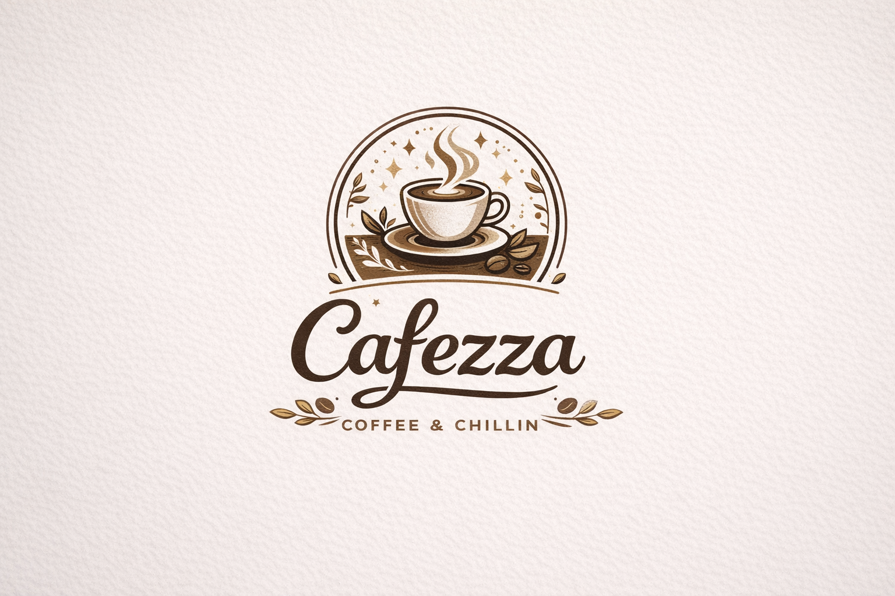

# ☕ AI Website Copy Generator for Local Businesses

## Project Overview

This project demonstrates how **Prompt Engineering** can generate professional website copy for small businesses.

Many local businesses struggle with writing clear website content, strong value propositions, and persuasive call-to-actions. This project solves that problem by designing structured AI prompts that generate ready-to-use website copy.

---

## Business Chosen

Cafezza – Artisan Coffee Café  
Location: Ahmedabad, India

Cafezza is a cozy café designed for students, freelancers, and coffee lovers looking for a relaxing place to enjoy premium coffee and fresh bakery treats.

---

## Generated Website Content

The AI prompt system generates:

• Homepage copy  
• Services section  
• Call-to-action sections  
• Why choose us content  

All content is designed to be **clear, engaging, and conversion-focused**.

---

## Prompt Engineering Approach

The project uses several prompt engineering techniques:

- Role prompting
- Structured prompts
- Business-specific context
- Benefit-driven messaging
- Tone adaptation

---

## Tools Used

ChatGPT  
Prompt Engineering  
GitHub

---

## Project Structure
